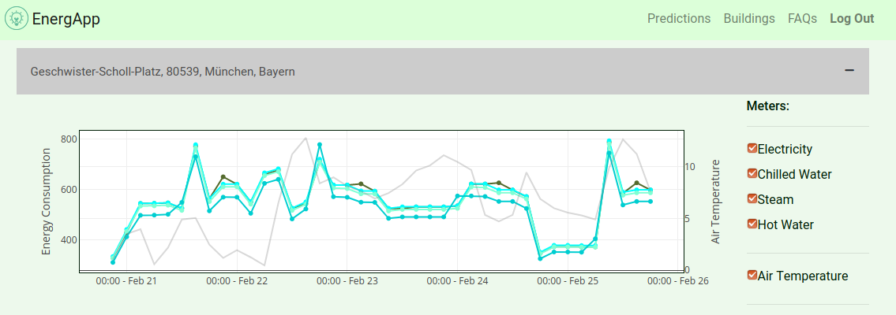
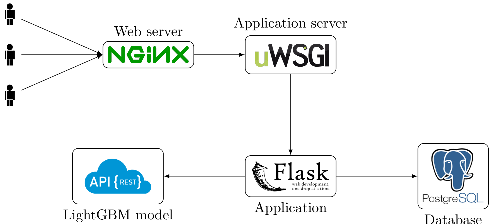

[](https://travis-ci.com/energeeks/ashrae-energy-prediction)

ASHRAE - Great Energy Predictor III Challenge
====================================

Who are we?
-------------
We are computer science & statistics students at LMU Munich and this project is happening as part of a Data Science Practical. Our plan was to participate in the associated Kaggle Challenge and subsequently build a product surrounding the trained model. Eventually we placed 160th in the public leaderboard and unfortunately only 509th in the private leaderboard.

Have fun checking out our stuff!

Cheers

Phase 1 - The Kaggle Challenge
------------

Challenge Description
------------

- Q: How much does it cost to cool a skyscraper in the summer?
- A: A lot! And not just in dollars, but in environmental impact.

Thankfully, significant investments are being made to improve building efficiencies to reduce costs and emissions. So, are the improvements working? That’s where you come in. Current methods of estimation are fragmented and do not scale well. Some assume a specific meter type or don’t work with different building types.

Developing energy savings has two key elements: Forecasting future energy usage without improvements, and forecasting energy use after a specific set of improvements have been implemented, like the installation and purchase of investment-grade meters, whose prices continue to fall. One issue preventing more aggressive growth of the energy markets are the lack of cost-effective, accurate, and scalable procedures for forecasting energy use.

In this competition, you’ll develop accurate predictions of metered building energy usage in the following areas: chilled water, electric, natural gas, hot water, and steam meters. The data comes from over 1,000 buildings over a three-year timeframe.

With better estimates of these energy-saving investments, large scale investors and financial institutions will be more inclined to invest in this area to enable progress in building efficiencies.

The Data Set
---------------

The provided data consists of ~20 mio. rows for training (one year timespan) and ~40 mio. rows for testing (two years timespan). The target variable are the hourly readings from one of four meters {0: electricity, 1: chilledwater, 2: steam, hotwater: 3}. For building the model the data provides following features out of the box:


- building_id --> Foreign key for the building metadata.
- meter ---> The meter id code. Read as {0: electricity, 1: chilledwater, 2: steam, hotwater: 3}
- timestamp --> Hour of the measurement
- site_id --> Identifier of the site the building is on
- primary_use ---> Primary category of activities for the building 
- square_feet --> Floor area of the building
- year_built ---> build year of the building
- floorcount - Number of floors of the building

Further weather data has been provided, which comes with air_temperature, cloud_coverage, dew_temperature, precip_depth_1_hr, sea_level_pressure, wind_direction and wind_speed.

Getting started
---------------

1. **The Data**

   The raw data has to be placed in `data/raw`. A good practice is to download the data via the Kaggle CLI.
    ```
    kaggle competitions download -c ashrae-energy-prediction
    mkdir -p data/raw
    unzip ashrae-energy-prediction.zip -d data/raw
    ```

2. **Use the configuration file**

   The configuration settings are located in `src/config.yml`. This is important to customize feature engineering and model training.

3. **Prepare data for training**

   Using `make data` the data is loaded and the several `.csv`-files will be joined to a consistent data frame. The result is saved in `data/interim`.
   Next use `make features` to conduct the feature engineering process. The result is saved in `data/processed`.

4. **Train a model**

   The frameworks being uses are LightGBM, CatBoost and XGBoost. We personally had our best experiences with LightGBM, but feel free to try differen frameworks or setting. The default settings are the parameters that have been determined through a hyperparameter search.
   To train a model use `make train MODEL=<framework> MODE=<mode>`. For the `MODEL` parameter you can use lgbm (LightGBM), ctb (CatBoost) or xgb (XGBoost). All Models work with `MODE=cv` (Cross Validation), which is our preferred way that gave us the best results. For LightGBM there are also following options available: full (training on whole dataset w/o validation set), by_meter (training a model by meter type), by_building (training a model by building id).
   The models will be safed in the equally named directory.
   
   
5. **Make a prediction**

   The easiest way is to use `make predict MODEL_PATH=<modelpath> MODEL=<model>` where `MODEL_PATH` should point to the directory of the saved models or the model itself. The `MODEL` parameter describes the framework of the model equivalent to the step above. The result is a `.csv` file, which is dumped in the `submission` directory and is ready for uploading to Kaggle. An importen flag is whether to use leaks or not as it heavily influences the resulting submission file.
   
6. **Submit to Kaggle**

   The submission file can be uploaded to the respective Kaggle challenge simply via the CLI tool.
   ```
   kaggle competitions submit -c ashrae-energy-prediction -f submission.csv -m "<submit message>"
   ```
   Keep in mind that your authentication reasons your Kaggle token has to be placed in `~/.kaggle`.
   
   
Leaks
------------

Unfortunately a portion of the test labels have been leaked, which stirred the whole competition. If you want to use the leaks for your own experiments, you have the set the respective flags in the config file. Additionally the leaks have to be downloaded from [here](https://www.kaggle.com/yamsam/ashrae-leak-data-station) and be placed in `./data/leaks`.


Phase 2 - Developing a web application
------------
Description
------------
The aim of part two of this project focuses on the development of a web application, which must incorporate the predicted model from phase 1. Obviously this is now more or less a proof of concept, but the main idea is that users (e.g. housing associations) can enter their real estates and are able to predict energy consumption of these for a defined period of time. Hence time points with high energy needs can be identified. So far the forecast only includes a range of 5 days since this is the limit for free usage of our chosen weather api.

Example for a prediction with the EnergApp
------------

<p align="center">

</p>

App Architecture
----------------
<p align="center">

</p>
The app consists of a classic nginx/uwsgi/flask stack and is deployed as a composition of three microsvervices: the app itself (front end / necessary backend), Postgres Database for user/building data, LightGBM model served via REST api.

Model API
----------------
Our app comes with a built in API to receive energy predictions. The endpoint is available at port 5001 and extension `/predict`. To get a prediction you need to attach a json payload with following attributes. An example can be found [here](docs/example_request.json). The easiest way to obtain a fitting format is to convert a pandas dataframe to json using the built in methods.

| Feature                   | Value |
|---------------------------|-------|
| primary\_use              |  Integer from 0 - 16 describing primary use of building.  |
| square\_feet              |   Float describing logarithm of square feets of the building   |
| year\_built               | Integer describing the year built   |
| cloud\_coverage           |   Float describing cloud coverage  |
| meter                     |    Integer between 0 and 3 describing the desireg meter   |
| floor\_count              |   Integer describing number of floors    |
| air\_temperature          |   Float describing air temperature    |
| relative\_humidity        |    Float describing relative humidity   |
| dew\_temperature          |   Float describing dew temperature    |
| precip\_depth\_1\_hr      |   Float describing hourly precipitation     |
| air\_temp\_f              |   Float describing air temperature in fahrenheit    |
| feels\_like\_temp         |  Float describing feels like temperature     |
| hour                      |   Integer between 0 and 23    |
| weekday                   |   Integer between 0 and 6    |
| area\_per\_floor          |   Float with square\_feet /  floor\_count  |
| outlier\_square\_feet     |    Boolean if square feet is an outlier (usually no)   |
| outlier\_area\_per\_floor |   Boolean if area per floor is an outlier (usually no)    |
| air\_temperature\_6\_lag  |   6 hour Rolling Average |
| air\_temperature\_24\_lag |    24 hour Rolling Average   |
| dew\_temperature\_6\_lag  |    6 hour Rolling Average   |
| dew\_temperature\_24\_lag |    24 hour Rolling Average   |
| cloud\_coverage\_6\_lag   |   6 hour Rolling Average    |
| cloud\_coverage\_24\_lag  |   24 hour Rolling Average    |

Getting started
---------------

**Requirements:**

 - Docker 19.03 or above (for [multi-stage builds](https://docs.docker.com/engine/userguide/eng-image/multistage-build/#use-multi-stage-builds))

### Build the app

Go into `./app` and run the command:

``` shell
$ docker-compose up --build
```
Open `http://localhost:80` and enjoy!
Don't forget to enter your openweathermap API key in `config.py`.

### Download the model
To use the app, you must download the model from
([here](https://syncandshare.lrz.de/getlink/fiD1gABUea7DCGjAidDfSyXq/)) and save it as `./app/model/model.txt`.

### Optional: Build the pre-processing package

If you have changed the pre-processing code, go to the project root run:

``` shell
$ python setup.py bdist_wheel
$ cp dist/energeek-0.1.0-py3-none-any.whl app/app/packages/
```

Project Organization
------------

    ├── LICENSE
    ├── Makefile           <- Makefile with commands like `make data` or `make train`
    ├── README.md          <- The top-level README for developers using this project.
    ├── app                <- The top-level directory for all files regarding the web app.
    ├── data
    │   ├── external       <- Data from third party sources.
    │   ├── interim        <- Intermediate data that has been transformed.
    │   ├── processed      <- The final, canonical data sets for modeling.
    │   └── raw            <- The original, immutable data dump.
    │
    ├── docs               <- A default Sphinx project; see sphinx-doc.org for details
    │
    ├── models             <- Trained and serialized models, model predictions, or model summaries
    │
    ├── notebooks          <- Jupyter notebooks. Naming convention is a number (for ordering),
    │                         the creator's initials, and a short `-` delimited description, e.g.
    │                         `1.0-jqp-initial-data-exploration`.
    │    
    ├── reports            <- Generated analysis as HTML, PDF, LaTeX, etc.
    │   └── figures        <- Generated graphics and figures to be used in reporting
    │
    ├── requirements.txt   <- The requirements file for reproducing the analysis environment, e.g.
    │                         generated with `pip freeze > requirements.txt`
    │
    ├── setup.py           <- makes project pip installable (pip install -e .) so src can be imported
    ├── src                <- Source code for use in this project.
    │   ├── __init__.py    <- Makes src a Python module
    │   │
    │   ├── data           <- Scripts to download or generate data
    │   │   └── make_dataset.py
    │   │
    │   ├── features       <- Scripts to turn raw data into features for modeling
    │   │   └── build_features.py
    │   │
    │   ├── models         <- Scripts to train models and then use trained models to make
    │   │   │                 predictions
    │   │   ├── predict_model.py
    │   │   └── train_lgbm_model.py
    │   │   └── train_ctb_model.py
    |   │   └── train_xgb_model.py
    │   │   └── find_hyperparameter_lgbm.py
    │   │
    │   └── visualization  <- Scripts to create exploratory and results oriented visualizations
    │
    └── tox.ini            <- tox file with settings for running tox; see tox.testrun.org

